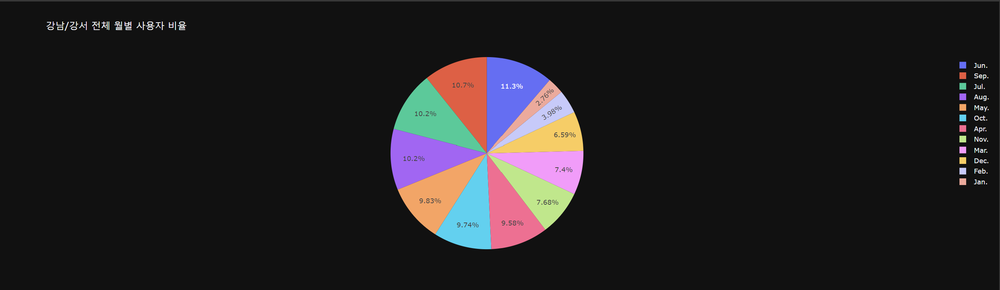
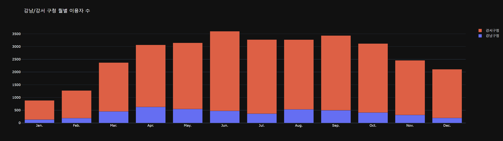
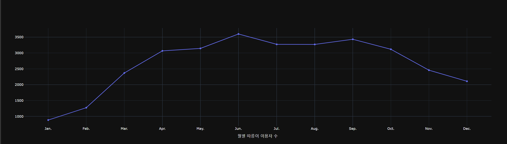
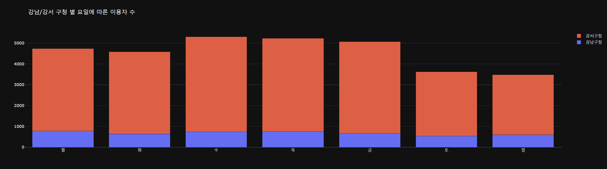
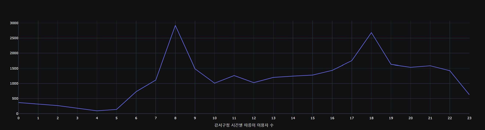
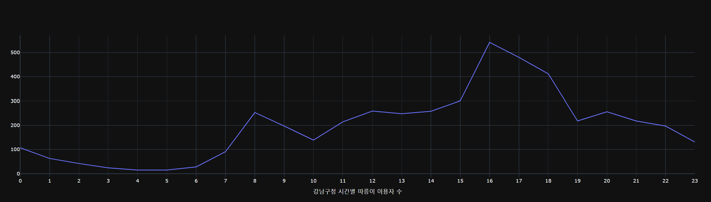
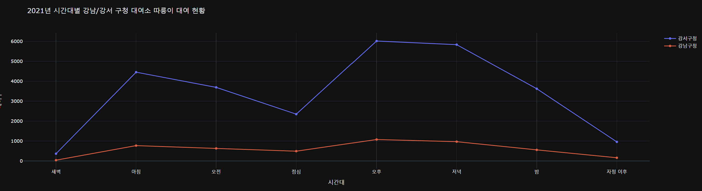
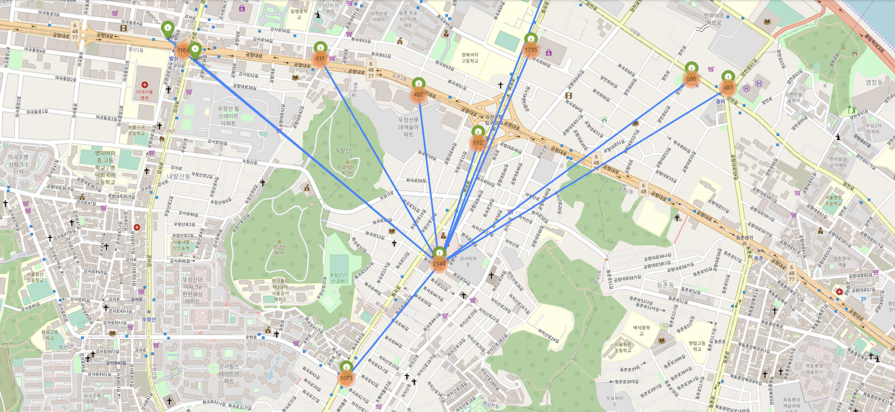
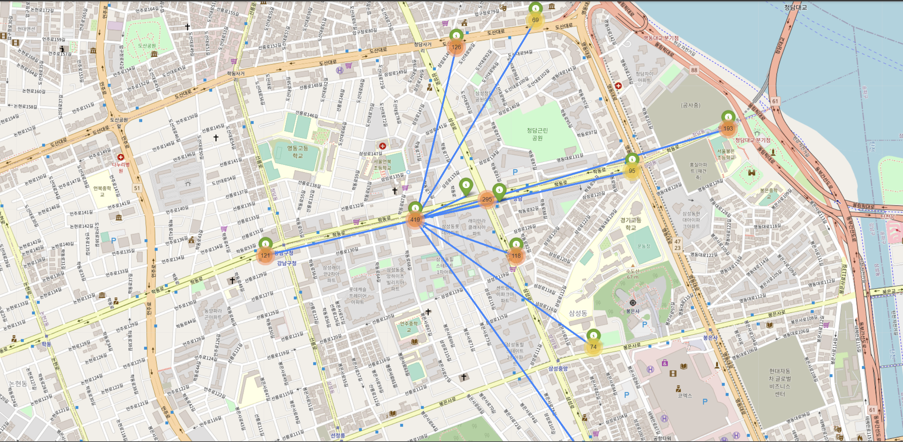

# Data-Visualization-project

강남구청과 강서구청의 2021년 따릉이 대여 데이터를 활용하여 시각화 프로젝트

# 프로젝트 기간

22.07.28일 ~ 22.07.29일

## 개발환경

Pythonn - 3.8  

## 그래프 시각화

### `월별 그래프`

### `요일별 그래프`
  

### `시간대별 그래프`

  

## 지도 시각화
### `강서 지도` 
  

### `강남 지도`  
  
